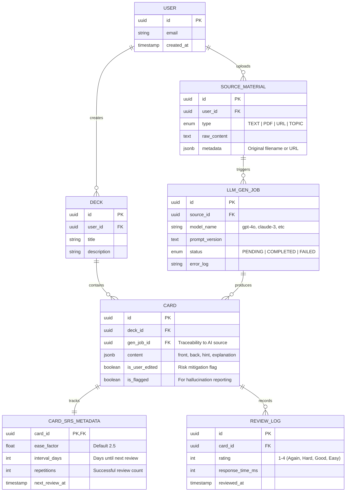

- fetches for user are done via deck
``` SQL
SELECT
FROM DECK d
INNER JOIN CARD c ON d.Id = c.deck_id
WHERE d.user_id = @userid
```

### Engineering Justifications

#### 1. The is_user_edited Flag (Risk Mitigation)

- **Reasoning:** LLMs are prone to hallucinations. When a user manually corrects a flashcard, we set is_user_edited to true.
    
- **Justification:** This allows us to differentiate between "Gold Standard" content (user-verified) and "Raw AI" content. If we update our LLM prompt later, we know not to overwrite cards the user has already fixed.
    

#### 2. jsonb content in the Card Table (Speed & Flexibility)

- **Reasoning:** Flashcards aren't always just "Front/Back." They might be "Cloze Deletion," "Multiple Choice," or "Image Occlusion."
    
- **Justification:** Using a JSONB column (Postgres) allows the PoC to support multiple card types without schema migrations. We can iterate on the LLM's output format (e.g., adding a "Mnemonic" field) instantly.
    

#### 3. Decoupling CARD_SRS_METADATA from CARD

- **Reasoning:** The content of the card (what you learn) is conceptually different from the learning progress (when you see it).
    
- **Justification:** This allows for a "Reset Progress" feature by simply wiping the metadata table without losing the generated cards. It also makes the CARD table more performant for full-text search since it's not being updated every time a user reviews a card.
    

#### 4. The LLM_GEN_JOB Audit Trail

- **Reasoning:** LLM costs and latency are the biggest bottlenecks in production.
    
- **Justification:** By logging the model_name and prompt_version for every batch of cards, we can perform A/B testing. We can analyze if gpt-4o creates cards that users "Flag" less often than gpt-4-turbo, allowing for data-driven cost optimization.
    

#### 5. SOURCE_MATERIAL Centralization

- **Reasoning:** Users often want to generate cards from the same PDF multiple times (e.g., "Generate 10 more cards").
    
- **Justification:** Storing the source independently avoids redundant uploads and allows us to implement **RAG (Retrieval-Augmented Generation)** in the future by indexing these sources into a vector store.